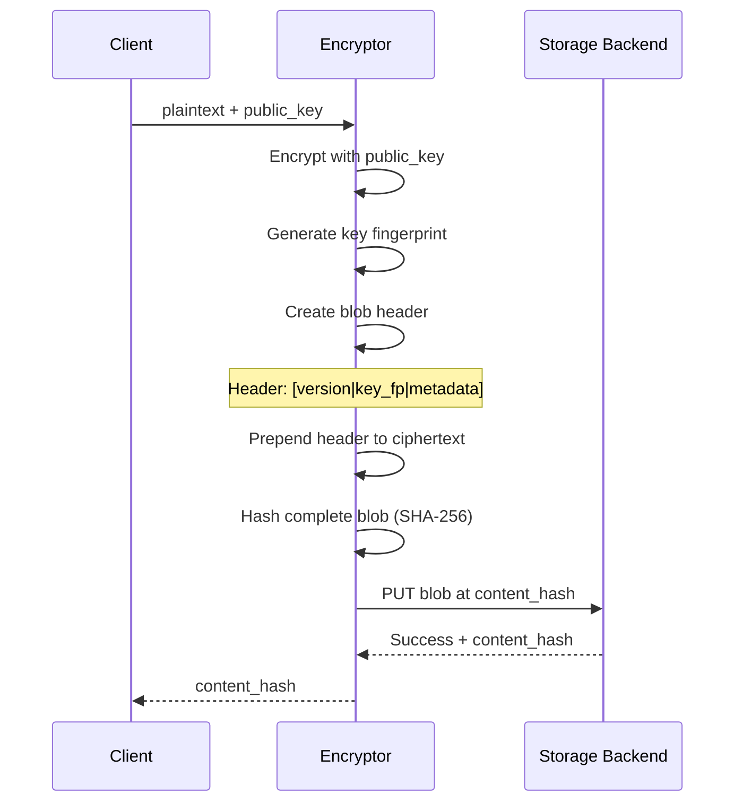
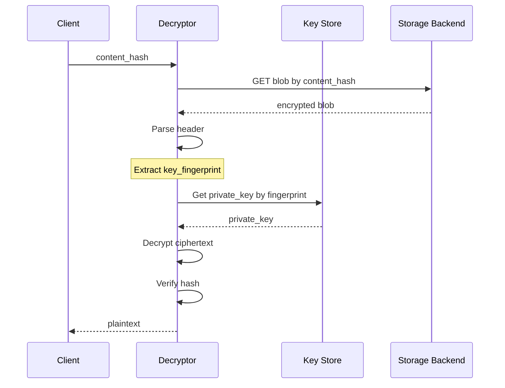
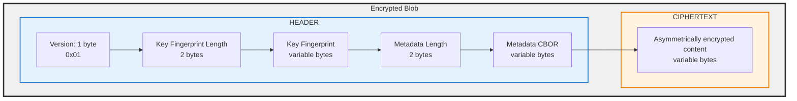
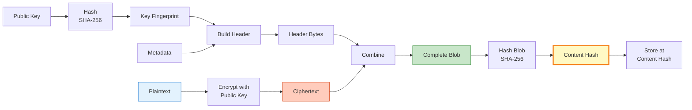
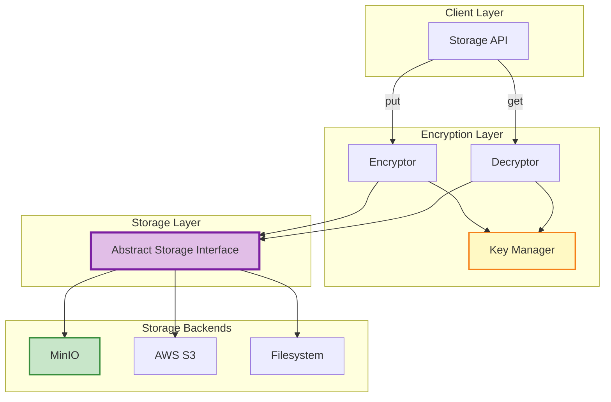
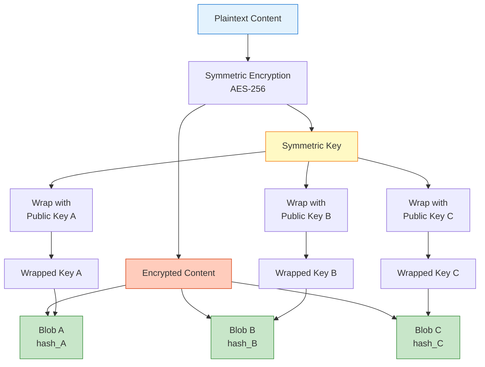

# Content-Addressable Encrypted Storage Architecture

## Overview

A backend-agnostic, content-addressable storage system for encrypted blobs. Files are encrypted with keypairs, stored by their content hash, and include embedded metadata for key identification during decryption.

## Design Principles

1. **Content-Addressable**: Retrieval by content hash, not filesystem paths
2. **Backend-Agnostic**: Configurable storage backend (default: MinIO)
3. **Key-Aware**: Embedded metadata tracks which keypair encrypted each blob
4. **Security-First**: Hash ciphertext to prevent correlation attacks
5. **Simple MVP**: Single-recipient encryption, extensible to multi-recipient

## Core Flow

### Storage Flow (Encryption + Upload)



### Retrieval Flow (Download + Decryption)



## Blob Structure

Each stored blob contains a structured header followed by the ciphertext:



### Header Fields

- **Version**: Protocol version for future compatibility
- **Key Fingerprint**: SHA-256 hash of public key (identifies which keypair)
- **Metadata**: CBOR-encoded object with optional fields:
  - `algorithm`: Encryption algorithm used (e.g., "RSA-OAEP", "ECIES")
  - `timestamp`: When encrypted (Unix timestamp)
  - `original_filename`: Optional filename hint
  - `content_type`: MIME type
  - `checksum`: Hash of plaintext (for verification after decryption)

**Why CBOR over JSON?**

- More compact (20-40% smaller for typical metadata)
- Native binary support (no base64 encoding needed)
- Faster parsing in binary contexts
- Self-describing like JSON but optimized for machine processing
- Standard for constrained environments (RFC 8949)

### Encryption Process Flow



## Component Architecture



## Key Design Decisions

### 1. Hash Ciphertext, Not Plaintext

**Rationale**: Hashing plaintext could enable correlation attacks if hashes are exposed. An attacker with known plaintext could compute hashes and identify encrypted files.

**Trade-off**: We lose deduplication across different encryption keys, but gain security. Same plaintext encrypted with different keys = different content hashes.

### 2. Embedded Metadata vs. Separate Store

**Decision**: Embed key fingerprint and metadata (CBOR-encoded) in the blob itself.

**Rationale**:

- ✅ Backend-agnostic (no dependency on metadata features)
- ✅ Atomic operation (metadata can't desync from ciphertext)
- ✅ Simpler architecture (no separate metadata DB)
- ✅ Portable (blob is self-contained)
- ✅ CBOR encoding keeps overhead minimal (~20-40% smaller than JSON)

**Trade-off**: Slightly larger storage overhead, but CBOR mitigates this and it's negligible for typical file sizes.

### 3. Content Hash as Primary Identifier

**Decision**: Use SHA-256 hash of complete blob (header + ciphertext) as the storage key.

**Rationale**:

- Natural content addressing
- Collision-resistant (SHA-256)
- No need for separate ID generation
- Immutable (same content = same hash)

**Extension Point**: For multi-recipient scenarios, can use composite keys like `{content_hash}-{recipient_fingerprint}`.

## Decision Summary (MVP)

| Category        | Decision                                                                 | Version      | Rationale                                                |
| --------------- | ------------------------------------------------------------------------ | ------------ | -------------------------------------------------------- |
| Crypto Library  | TweetNaCl (XSalsa20-Poly1305 for symmetric, Curve25519 for key exchange) | MVP (no pin) | Simple, audited primitives; good perf; libsodium lineage |
| Header Schema   | Zod for validation + CBOR for encoding                                   | MVP          | Strong runtime validation; compact binary metadata       |
| Hashing         | SHA-256 of complete blob (header + ciphertext)                           | N/A          | Prevent plaintext correlation; immutable addressing      |
| Storage Backend | MinIO (default), pluggable adapter interface                             | N/A          | Local dev-friendly; backend-agnostic via adapters        |
| Caching         | None                                                                     | N/A          | Keep MVP simple; avoid premature complexity              |
| Error Handling  | Explicit TODOs, minimal baseline checks                                  | N/A          | Defer non-critical paths; keep surface tight             |

## Multi-Recipient Pattern (Future)

For scenarios where the same content needs to be accessible by multiple keypairs:



1. Encrypt content once with a random symmetric key (e.g., AES-256)
2. Encrypt symmetric key separately for each recipient's public key
3. Store as separate blobs with unique content hashes
4. Each blob header includes recipient's key fingerprint

## Backend Configuration

Storage backend is configurable via environment variables or config file:

```typescript
interface StorageConfig {
  backend: "minio" | "s3" | "filesystem" | "custom";
  endpoint?: string;
  credentials?: {
    accessKey: string;
    secretKey: string;
  };
  bucket?: string;
  region?: string;
  basePath?: string; // for filesystem backend
}
```

**Default**: MinIO instance at configurable endpoint.

## Header Schema and Operations (MVP)

- Schema: Zod-validated structure; encoded as CBOR in header.
- Operations:
  1. buildHeader(metadata) → Buffer
  2. parseHeader(buffer) → { header, ciphertextOffset }
  3. validateHeader(header) → void (throws on invalid)

Schema fields (MVP):

- version: number (1)
- keyFingerprint: string (hex, sha256(pubkey))
- metadata: object (algorithm, timestamp, originalFilename?, contentType?, plaintextChecksum?)

Notes:

- All schema validations are runtime via Zod; strict mode on.
- Serialization: Zod → CBOR bytes; prepend lengths as defined.
- Deserialization: slice/parse; validate with Zod prior to use.

## Crypto Choices (MVP)

- Use TweetNaCl primitives:
  - Public-key: X25519 for key agreement; derive shared key
  - Symmetric: XSalsa20-Poly1305 (via secretbox/box) for AEAD
- Key Fingerprint: sha256(publicKey) hex
- Rationale: audited, minimal, performant; good dev ergonomics

## Security Considerations

### Encryption

- **Algorithm**: RSA with OAEP padding or ECIES for asymmetric encryption
- **Key Size**: Minimum 2048-bit for RSA, 256-bit for ECC
- **Padding**: Always use proper padding (OAEP) to prevent chosen-ciphertext attacks

### Key Management

- Private keys stored securely (encrypted at rest, in-memory when needed)
- Key fingerprints use SHA-256 for collision resistance
- Support for key rotation (new fingerprint = new blob)

### Integrity

- Content hash verifies blob integrity on retrieval
- Optional plaintext checksum in metadata for post-decryption verification
- Header should be integrity-protected (HMAC or authenticated encryption)

### Access Control

- Backend-level access controls (IAM, bucket policies)
- Content hashes are effectively unguessable (2^256 space)
- No directory enumeration (content-addressable = no listing)

## API Design

### TypeScript Interface

```typescript
interface EncryptedStorage {
  /**
   * Encrypt and store content
   * @returns content hash for retrieval
   */
  put(
    plaintext: Buffer,
    publicKey: KeyPair,
    metadata?: BlobMetadata
  ): Promise<string>;

  /**
   * Retrieve and decrypt content
   * @param contentHash - Hash returned from put()
   * @returns decrypted content
   */
  get(contentHash: string, privateKey?: KeyPair): Promise<Buffer>;

  /**
   * Check if content exists
   */
  exists(contentHash: string): Promise<boolean>;

  /**
   * Delete content (if backend supports)
   */
  delete(contentHash: string): Promise<void>;

  /**
   * Get blob metadata without decrypting
   */
  getMetadata(contentHash: string): Promise<BlobMetadata>;
}

interface BlobMetadata {
  algorithm: string;
  keyFingerprint: string;
  timestamp: number; // Unix timestamp
  originalFilename?: string;
  contentType?: string;
  plaintextChecksum?: string;
}

// Note: BlobMetadata is CBOR-encoded in the header, not JSON
```

### Minimal Project Structure (MVP)

```
src/
  crypto/
    encryptor.ts           # uses TweetNaCl; box/secretbox wrapper
    decryptor.ts           # reverse ops; header parse first
  header/
    schema.ts              # Zod schema for header
    serialize.ts           # buildHeader(metadata) → Buffer
    parse.ts               # parseHeader(buf) → { header, ciphertextOffset }
    fingerprint.ts         # sha256 public key → hex
  storage/
    adapter.ts             # interface { put/get/exists/delete }
    minio-adapter.ts       # MinIO implementation
  api/
    encrypted-storage.ts   # implements EncryptedStorage using above
```

Naming conventions:

- Files: kebab-case; one exported type/class/function per file where feasible
- Functions: verb-first; inputs/outputs typed; no `any`

## Error Handling (Explicit TODOs for Later)

MVP enforces minimal guardrails. The following error paths are explicitly deferred and MUST be implemented post-MVP:

- Header tamper detection beyond AEAD (e.g., AAD/HMAC over header bytes) — TODO
- Partial upload recovery/idempotency for `put` — TODO
- Key lookup miss and rotation window handling — TODO
- Decryption failure taxonomy (nonce mismatch, MAC fail) — TODO
- Metadata size limits and denial-of-service guards — TODO
- Backend consistency checks (exists after put) — TODO

Baseline MVP checks:

- Zod validation on header pre/post (parse/build)
- AEAD authentication via TweetNaCl primitives
- SHA-256 content hash verification on retrieval

## Caching Strategy

None for MVP. All lookups and header parses are performed per request.

## Implementation Phases

### Phase 1: MVP (Current)

- ✅ Single-recipient encryption
- ✅ MinIO backend
- ✅ Basic put/get operations
- ✅ Embedded metadata

### Phase 2: Enhanced

- Multiple backend support (S3, filesystem)
- Key rotation support
- Metadata querying
- Batch operations

### Phase 3: Advanced

- Multi-recipient encryption
- Streaming encryption for large files
- Compression before encryption
- Access audit logging

## Testing Strategy

### Unit Tests

- Header serialization/deserialization
- Hash generation correctness
- Key fingerprint computation
- Metadata encoding/decoding (CBOR round-trip)
- CBOR edge cases (null values, large integers, binary data)

### Integration Tests

- End-to-end encrypt → store → retrieve → decrypt cycle
- Backend failover scenarios
- Large file handling (>100MB)
- Concurrent operations

### Security Tests

- Key fingerprint collisions (statistical test)
- Padding oracle attacks (if applicable)
- Metadata tampering detection
- Private key isolation

## Performance Considerations

### Bottlenecks

1. **Asymmetric encryption** - Slow for large files
   - **Mitigation**: Hybrid encryption (symmetric content + asymmetric key wrapping)
2. **Network I/O** - Backend latency
   - **Mitigation**: Connection pooling, parallel uploads
3. **Hash computation** - CPU-bound for large files
   - **Mitigation**: Streaming hash computation

### Benchmarks (Target)

- Encrypt + upload 1MB file: <500ms
- Download + decrypt 1MB file: <300ms
- Hash computation: >100MB/s
- Backend round-trip: <100ms (local MinIO)

## Open Questions

1. **Key Discovery**: How does the system know which private keys are available?

   - Option A: Key store abstraction with fingerprint lookup
   - Option B: Try keys until one works (fallback)
   - **Recommendation**: Key store with fingerprint index

2. **Garbage Collection**: How to handle orphaned blobs?

   - Reference counting?
   - TTL-based expiration?
   - Manual cleanup?

3. **Versioning**: Support multiple versions of same logical content?

   - Each version gets unique hash naturally
   - Need separate index for version tracking

4. **Large Files**: Stream vs. buffer entire file?
   - **Recommendation**: Streaming API for files >10MB

## Related Work

- **IPFS**: Content-addressable storage, but typically unencrypted
- **Git**: Content-addressable, but uses tree structure
- **S3 SSE**: Server-side encryption, but not content-addressable
- **Tahoe-LAFS**: Distributed encrypted storage with similar principles

## References

- [CBOR - RFC 8949](https://datatracker.ietf.org/doc/html/rfc8949) - Concise Binary Object Representation
- [ECIES Encryption](https://en.wikipedia.org/wiki/Integrated_Encryption_Scheme)
- [Content-Addressable Storage](https://en.wikipedia.org/wiki/Content-addressable_storage)
- [MinIO Documentation](https://min.io/docs/minio/linux/index.html)
- [RSA-OAEP](https://datatracker.ietf.org/doc/html/rfc3447)
